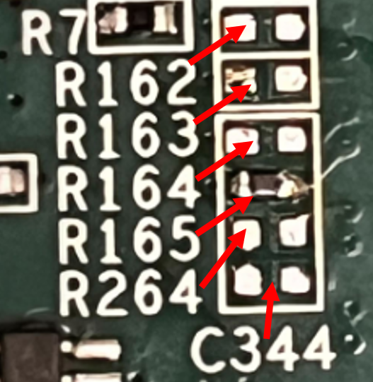

# SD Card Boot

Confirm that MODE[3:0]_C2M = b"1110" for SD-memory boot mode (non-default loading)

```
MODE3_C2M = R162 = open (remove resistor)
MODE2_C2M = R163 = open (remove resistor)
MODE2_C1M = R164 = open (default)
MODE2_C0M = R165 = 499 Ohm (default)
```

